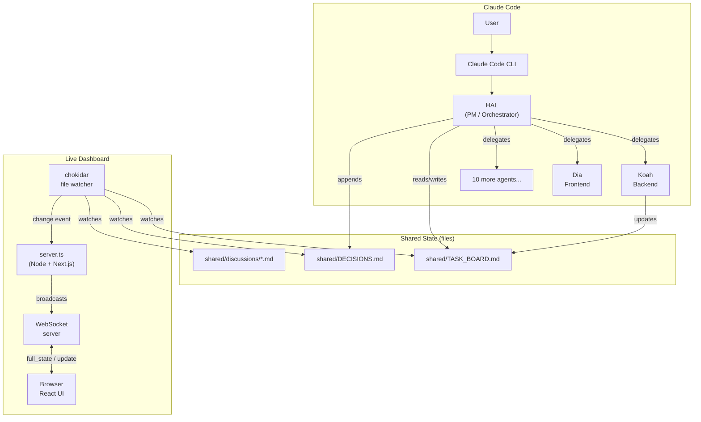
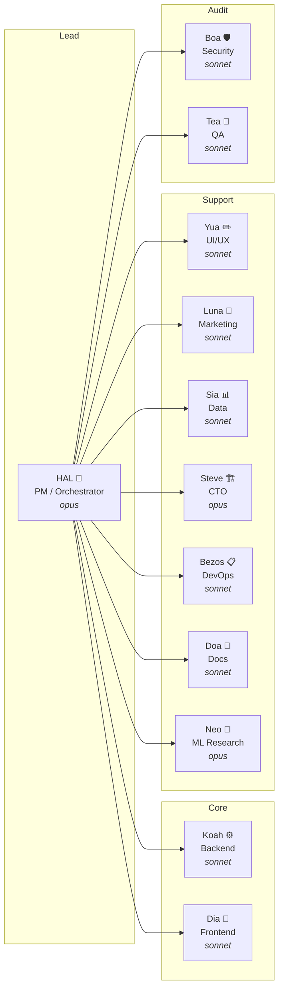
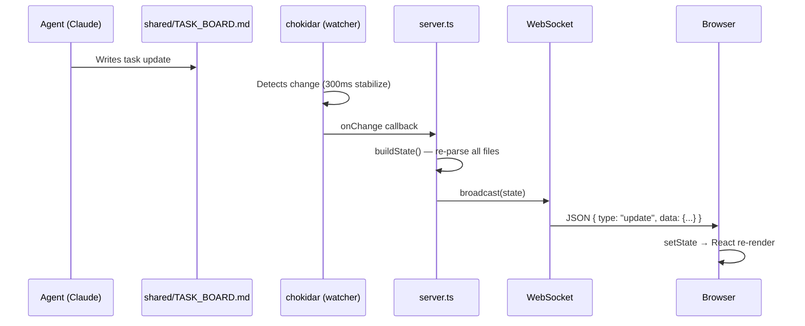
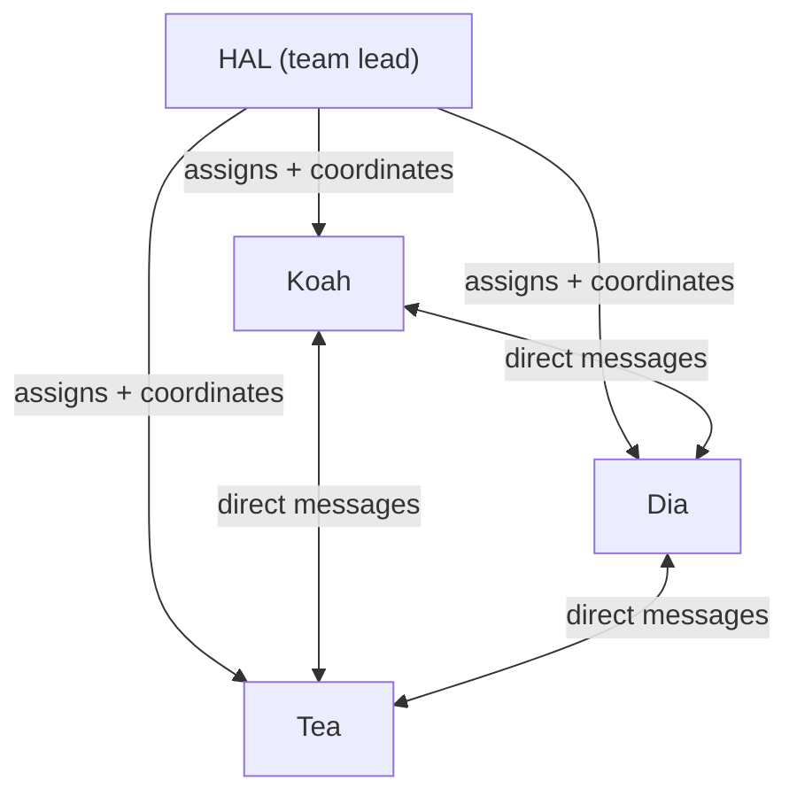

# Soulcraft

> 12 AI agents with souls. A Claude Code plugin for multi-agent development.

## TL;DR

Soulcraft is a Claude Code plugin that gives you **12 specialized AI agents** — each with a unique persona, role, tool permissions, and persistent memory. HAL (the PM) auto-triages every request and delegates to the right agent. A **live Next.js dashboard** shows your task board, agent statuses, and project activity in real time via WebSocket.

```bash
claude plugin add ./soulcraft   # install
/soulcraft:init                  # set up shared state
cd dashboard && npm run dev      # start live dashboard at localhost:3000
```

---

## Architecture



**How it flows:**
1. You talk to Claude Code normally. HAL receives all unaddressed requests.
2. HAL breaks work into tasks, assigns agents, updates `shared/TASK_BOARD.md`.
3. Agents execute their work and update shared state files.
4. The dashboard's `chokidar` watcher detects file changes within 300ms.
5. `server.ts` re-parses all files and broadcasts the new state via WebSocket.
6. The browser receives the update and re-renders instantly.

---

## Install

```bash
claude plugin add ./soulcraft
```

## Quick Start

```bash
cd ~/projects/my-app
claude

# Initialize the project
> /soulcraft:init

# Assign work
> /soulcraft:assign koah "build user authentication API"
> /soulcraft:assign dia "login page with OAuth buttons"

# Or just ask — HAL auto-delegates
> "Build a REST API for scoring"        → HAL → Koah
> "Design the onboarding flow"          → HAL → Yua
> "Is this auth implementation secure?" → HAL → Boa

# Check status
> /soulcraft:status

# Open live dashboard
> /soulcraft:board
```

---

## Agents

Soulcraft has 12 agents organized into four tiers. HAL is the default router — all unaddressed requests go to HAL first, who triages and delegates.



### Agent Details

| Agent | Role | Model | Tools | Key Traits |
|-------|------|-------|-------|------------|
| **HAL** | PM / Orchestrator | opus | Read, Write, Glob, Grep | Calm, decisive. Never writes production code. |
| **Koah** | Backend Engineer | sonnet | Full dev access | FastAPI, TypeScript, PostgreSQL, Docker |
| **Dia** | Frontend Engineer | sonnet | Full dev access | React, Next.js, Tailwind, Framer Motion |
| **Yua** | UI/UX Designer | sonnet | Read, Write, Glob, Grep | Design tokens, wireframes, accessibility |
| **Luna** | Marketing Lead | sonnet | Read, Write, Glob, Grep | Copy, SEO, email sequences |
| **Sia** | Data Analyst | sonnet | Read, Write, Bash, Glob, Grep | SQL, A/B tests, benchmarks |
| **Steve** | CTO / Architect | opus | Read only | Architecture review, ADRs, tech decisions |
| **Bezos** | DevOps / Ops | sonnet | Full dev access | Docker, CI/CD, cloud infra |
| **Boa** | Security Auditor | sonnet | Read only | OWASP Top 10, never modifies code |
| **Tea** | QA / Testing | sonnet | Read, Write, Bash, Glob, Grep | Unit/integration/E2E tests |
| **Doa** | Technical Writer | sonnet | Read, Write, Glob, Grep | API docs, READMEs, changelogs |
| **Neo** | ML Researcher | opus | Read, Write, Bash, Glob, Grep | Speech/audio, training pipelines |

### Auto-Delegation

HAL reads each agent's description and routes automatically:

```
"Build the scoring API"                → Koah (backend)
"Create a hero section with animation" → Dia (frontend)
"Design the onboarding user flow"      → Yua (UI/UX)
"Write a blog post about our launch"   → Luna (marketing)
"Benchmark these two models"           → Sia (data) or Neo (ML)
"Should we use Postgres or MongoDB?"   → Steve (architecture)
"Set up the CI/CD pipeline"            → Bezos (DevOps)
"Audit this auth flow for vulns"       → Boa (security, READ ONLY)
"Write tests for the scoring module"   → Tea (QA)
"Update the API documentation"         → Doa (docs)
"Plan this week's sprint"              → HAL (PM)
```

You can bypass HAL by naming an agent directly: `"Use the koah agent to build the API"`.

---

## Live Dashboard

The dashboard is a Next.js 15 app that watches `shared/` files and pushes changes to the browser in real time via WebSocket.

### Starting the Dashboard

```bash
cd dashboard
npm install   # first time only
npm run dev   # starts at http://localhost:3000
```

Or use the command:
```
> /soulcraft:board   # auto-detects running server, opens browser
```

### Dashboard Views

The dashboard has **4 views** accessible via tabs:

#### Overview
Stats grid (in progress / review / done / active agents), agent grid with status indicators, and recent git commits.

#### Board
4-column Kanban board mirroring `shared/TASK_BOARD.md`:
- **Backlog** (gray) → **In Progress** (gold) → **Review** (purple) → **Done** (teal)
- Each card shows priority badge, title, assigned agent face, and project tag.

#### Messages
Activity feed combining git commits and discussion thread summaries.

#### Decisions
Architecture Decision Records from `shared/DECISIONS.md`.

### Agent Dock

The top dock shows all 12 agents as Notion-style minimal SVG faces. Each has a unique micro-feature:

| Agent | Visual Feature |
|-------|---------------|
| HAL | Thin headband |
| Koah | Beanie with pom-pom |
| Dia | Star above head |
| Yua | Beret |
| Luna | Wavy hair strand |
| Sia | Round glasses with bridge |
| Steve | Spiky hair |
| Bezos | Collar v-shape |
| Boa | Visor across eyes |
| Tea | Magnifying glass |
| Doa | Pen behind ear |
| Neo | Wild Einstein hair + glasses |

Click any avatar to open the **Agent Detail** sidebar showing their tasks, commits, model, and invocation command.

### How Live Updates Work



The browser auto-reconnects if the server restarts (2-second retry loop).

### Dashboard Architecture

```
dashboard/
├── server.ts                    # Custom server: HTTP + WS + chokidar
├── package.json                 # Next.js 15, React 19, Tailwind v4
├── next.config.ts               # serverExternalPackages: [chokidar, ws]
├── app/
│   ├── layout.tsx               # IBM Plex Mono font, dark theme
│   ├── page.tsx                 # Main page — wires hook + components
│   ├── globals.css              # Tailwind @theme with SEON colors
│   └── components/
│       ├── Face.tsx             # 12 agent SVG faces (inline math)
│       ├── TopBar.tsx           # Header, view tabs, connection dot
│       ├── AgentDock.tsx        # 12 avatars with hover magnification
│       ├── AgentDetail.tsx      # Right sidebar detail panel
│       ├── TaskCard.tsx         # Priority badge + agent face
│       ├── KanbanBoard.tsx      # 4-column kanban
│       ├── OverviewView.tsx     # Stats + agent grid + commits
│       ├── MessagesView.tsx     # Git + discussion activity
│       ├── DecisionsView.tsx    # ADR list
│       └── StatusBadge.tsx      # Dot, PBadge, StatusBtn
└── lib/
    ├── types.ts                 # TypeScript interfaces
    ├── agents.ts                # AGENTS array + deriveAgentStatuses()
    ├── watcher.ts               # chokidar file watcher
    ├── ws-server.ts             # WebSocket broadcast server
    ├── parsers/
    │   ├── task-board.ts        # TASK_BOARD.md → Task[]
    │   ├── decisions.ts         # DECISIONS.md → Decision[]
    │   ├── discussions.ts       # Discussion files → Discussion[]
    │   └── git-log.ts           # git log → GitCommit[]
    └── hooks/
        └── use-dashboard.ts     # WS connect + auto-reconnect + state
```

---

## Commands

All commands are namespaced `soulcraft:` to avoid collisions.

### `/soulcraft:init`

Initialize Soulcraft in the current project. Creates the shared state directory.

```
> /soulcraft:init

Soulcraft initialized
  shared/TASK_BOARD.md  — Task board (empty)
  shared/DECISIONS.md   — Decision log
  shared/discussions/   — Discussion threads
```

### `/soulcraft:assign {agent} "{task}" [priority]`

Assign a task to a specific agent and add it to the task board.

```
> /soulcraft:assign koah "scoring API v3"
> /soulcraft:assign dia "hero section animation" P1
> /soulcraft:assign boa "auth flow review" P0
```

Priority levels: P0 (critical) → P1 (high) → P2 (medium, default) → P3 (low)

### `/soulcraft:status`

Quick inline status — shows active tasks, agent states, recent activity.
Prints directly in the terminal, under 20 lines.

```
> /soulcraft:status

SOULCRAFT — 11 tasks · Feb 20

IN PROGRESS
  Koah  Scoring API v2          [P0]
  Dia   Landing page redesign   [P1]

REVIEW
  Doa   API documentation       [P2]

BACKLOG (7 tasks)
  Top: Architecture review @steve [P1]
```

### `/soulcraft:board`

Opens the live dashboard if the server is running, otherwise prompts to start it.
Falls back to generating static HTML if the dashboard isn't installed.

```
> /soulcraft:board
→ Opens http://localhost:3000 in browser
```

### `/soulcraft:standup`

Generate a daily standup report from git activity and the task board.

```
> /soulcraft:standup

# Standup — Feb 20

## Done (last 24h)
- @bezos: Docker compose merged (T007)

## In Progress
- @koah: Scoring API v2 [P0]
- @dia: Landing page redesign [P1]

## Backlog Top
- Architecture review @steve [P1]
```

### `/soulcraft:sprint {name} {agent1} {agent2} ...`

Start a coordinated Agent Teams sprint. HAL acts as team lead,
named agents work in parallel with real-time messaging.

```
> /soulcraft:sprint talk45-launch koah dia tea
→ HAL leads, Koah + Dia + Tea work in parallel
→ Agents message each other directly
→ HAL synthesizes results when done
```

**Note**: Requires `CLAUDE_CODE_EXPERIMENTAL_AGENT_TEAMS=1` in settings.
Burns tokens ~5x faster. Use for big coordinated pushes.

### `/soulcraft:discuss "{topic}" {agent1} {agent2} ...`

Start a structured discussion thread between agents on a technical topic.

```
> /soulcraft:discuss "monolith vs microservices" steve koah bezos
→ Creates shared/discussions/2026-02-20-monolith-vs-microservices.md
→ Each agent adds their position with evidence
→ HAL closes with a final decision
```

### `/soulcraft:review {branch-or-path}`

Run a combined security + QA review by invoking Boa and Tea.

```
> /soulcraft:review koah/scoring-v2
→ Boa scans for vulnerabilities (READ ONLY)
→ Tea checks test coverage and quality
→ Combined report with severity ratings
```

---

## Shared State

Agents coordinate through files in `shared/` at the project root:

```
shared/
├── TASK_BOARD.md       # Kanban: Backlog → In Progress → Review → Done
├── DECISIONS.md        # Architecture decision records (append-only)
└── discussions/        # Per-topic discussion threads
    └── 2026-02-20-alignment-approach.md
```

### Task Board Format

```markdown
## In Progress
- [ ] `T001` Scoring API v2 @koah #talk45-pro P0
```

Each task has: ID, title, assigned agent, project tag, priority.
The dashboard parser uses regex: `- \[([ x])\] \`(T\d+)\` (.+?) @(\w+) #([\w-]+) (P[0-3])`

### Agent Status Derivation

Agent statuses are derived from their task assignments:
- **Active** (green): Has tasks in "In Progress"
- **Idle** (yellow): Has tasks in "Review" or "Backlog" only
- **Offline** (gray): No tasks assigned

---

## Skills

Skills are auto-discovered procedural knowledge that any agent can use.
You don't invoke them directly — agents load them when relevant.

| Skill | Loaded When | What It Provides |
|-------|------------|-----------------|
| task-management | Agent reads/writes task board | TASK_BOARD.md format rules |
| discussion | Creating/managing discussions | Discussion thread template |
| security-audit | Running security reviews | Systematic checklist |
| code-review | Reviewing code or PRs | Quality review process |
| standup | Generating standups | Report format + data gathering |

---

## Memory

Each agent has persistent memory that survives across sessions:

- **Koah** remembers codebase patterns, API conventions, past bugs
- **Tea** remembers test strategies, flaky tests, coverage gaps
- **Neo** accumulates research findings, benchmark results
- **HAL** tracks project history, decision patterns

Memory scope is set to `user` (per-user, across projects).
Stored at `~/.claude/agent-memory/{agent-name}/`.

---

## Agent Teams (Escalation)

For coordinated sprints where agents need real-time communication:

```
/soulcraft:sprint talk45-launch koah dia tea
```



This uses Claude Code's experimental Agent Teams feature:
- HAL becomes team lead, spawns named agents as teammates
- Each teammate gets their own context window
- Agents communicate via built-in inbox messaging
- Shared task list with file locking

**When to use**: Big pushes needing 2-4 agents working on the same
codebase simultaneously. Not for everyday work.

**Cost**: Each teammate burns tokens independently. A 3-agent sprint
might use 160 messages (~HAL 20 + Koah 80 + Dia 60) in one session.

---

## Security Model

Enforced via the `tools` field in each agent's frontmatter:

| Agent | Can Write Code | Can Execute | Notes |
|-------|---------------|------------|-------|
| Koah, Dia, Bezos | Yes | Yes | Full dev access |
| Tea | tests/ only | Yes | Test environment |
| Steve | No | Read only | Advisory only |
| Boa | No | Read only | **READ ONLY** — never modifies code |
| Others | Own domain | Limited | Scoped to role |

---

## Plugin Structure

```
soulcraft/
├── plugin.json                 # Plugin manifest
├── CLAUDE.md                   # Base context all agents inherit
├── DESIGN-GUIDE.md             # Visual specs for agent avatars
├── agents/                     # 12 subagent definitions
│   ├── hal.md                  #   PM / Orchestrator (default router)
│   ├── koah.md                 #   Backend Engineer
│   ├── dia.md                  #   Frontend Engineer
│   ├── yua.md                  #   UI/UX Designer
│   ├── luna.md                 #   Marketing Lead
│   ├── sia.md                  #   Data Analyst
│   ├── steve.md                #   CTO / Architect
│   ├── bezos.md                #   DevOps / Ops
│   ├── boa.md                  #   Security Auditor
│   ├── tea.md                  #   QA / Testing
│   ├── doa.md                  #   Technical Writer
│   └── neo.md                  #   ML Researcher
├── skills/                     # Shared procedural skills
│   ├── task-management/SKILL.md
│   ├── discussion/SKILL.md
│   ├── security-audit/SKILL.md
│   ├── code-review/SKILL.md
│   └── standup/SKILL.md
├── commands/                   # Slash commands → /soulcraft:*
│   ├── init.md
│   ├── assign.md
│   ├── status.md
│   ├── board.md
│   ├── standup.md
│   ├── sprint.md
│   ├── discuss.md
│   └── review.md
├── templates/
│   └── seon-dashboard.jsx      # Canonical UI reference
├── shared/                     # Team coordination state
│   ├── TASK_BOARD.md
│   ├── DECISIONS.md
│   └── discussions/
└── dashboard/                  # Live Next.js dashboard
    ├── server.ts               # Custom server (HTTP + WS + chokidar)
    ├── package.json
    ├── app/                    # Next.js App Router pages + components
    └── lib/                    # Parsers, types, hooks, watcher
```

---

## Requirements

- Claude Code with Max 20x subscription
- Agent Teams requires `CLAUDE_CODE_EXPERIMENTAL_AGENT_TEAMS=1`
- Dashboard requires Node.js 18+ (`cd dashboard && npm install && npm run dev`)

## License

MIT
